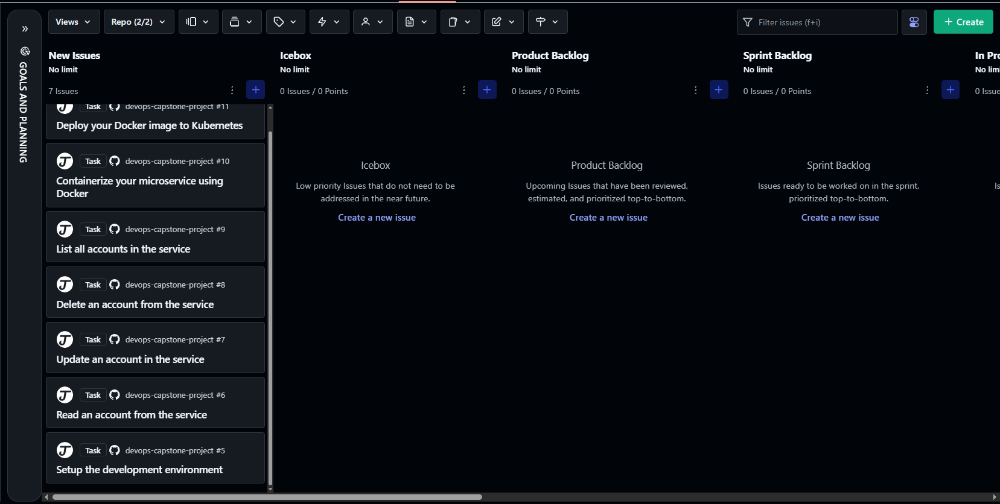
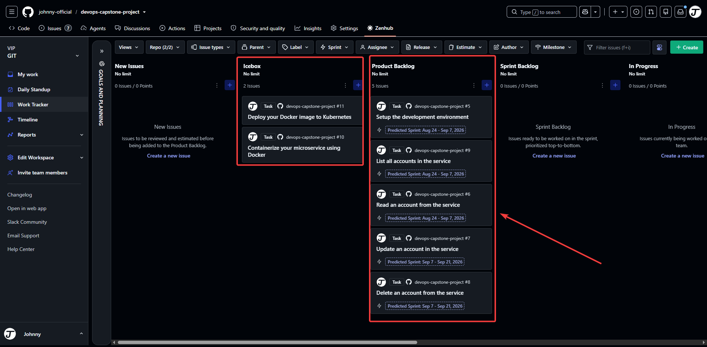
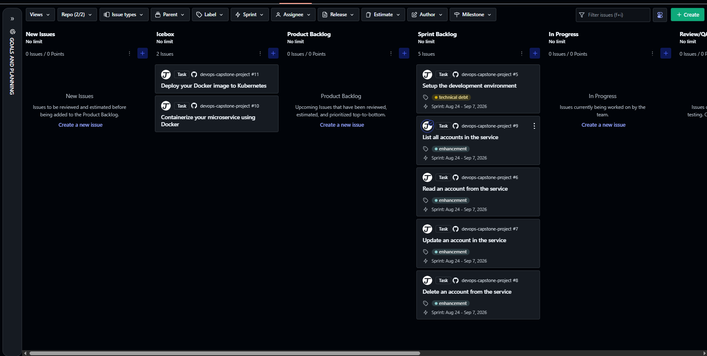
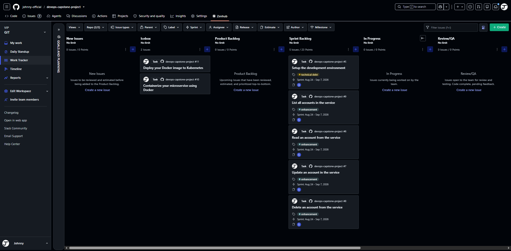

# Portfolio Evidence & Capture Guide

This guide turns the DevOps Capstone lab into credible portfolio evidence. It records what is already available, what must be captured in GitHub, and the exact filenames required by the lab.

> **Privacy check before every capture:** use a public repository only when it contains no credentials, access tokens, private URLs, customer data, or remote-server details. Blur browser profile information and terminal prompts that expose usernames or hosts.

## Replace these placeholders

| Placeholder | Replace with |
| --- | --- |
| `<OWNER>` | Your GitHub username or organization |
| `<REPOSITORY>` | Your public repository name |
| `<PROJECT_URL>` | `https://github.com/<OWNER>/<REPOSITORY>/projects/<NUMBER>` |
| `<BRANCH>` | Usually `main` |

### Public links for Questions 1 and 2

Use these only after the repository is public and pushed:

```text
Q1 README:
https://github.com/<OWNER>/<REPOSITORY>/blob/<BRANCH>/README.md

Q2 user-story template:
https://github.com/<OWNER>/<REPOSITORY>/blob/<BRANCH>/.github/ISSUE_TEMPLATE/user-story.md
```

For Question 1, the README must show a **green CI badge** first. The badge snippet is intentionally prepared in the root README, but should only be enabled after a successful workflow run.

## Planning evidence

The four required planning screenshots are already present in `10_docs/images/`. They are embedded here so the documentation acts as a portfolio case study as well as a lab checklist.

### Question 3 — user stories in New Issues

**Required filename:** `planning-userstories-done.png` or `.jpeg`  
**Capture location:** GitHub Project board, wide view with the project title and **New Issues** column visible.  
**What must be visible:** all user-story cards before triage.



**Replacement placeholder:** recapture after you create your own stories. Ensure these five stories are legible: development environment, read account, list accounts, update account, and delete account.

### Question 4 — stories in Ice Box

**Required filename:** `planning-productbacklog-done.png` or `.jpeg`  
**Capture location:** GitHub Project board with the **Ice Box** column centered.  
**What must be visible:** the planned user stories under Ice Box.



**Replacement placeholder:** show the project name, Ice Box column, and every card in that column. Zoom to 90–100% so titles remain readable.

### Question 5 — Product Backlog labels

**Required filename:** `planning-labels-done.png` or `.jpeg`  
**Capture location:** GitHub Project board with the **Product Backlog** column visible.  
**What must be visible:** cards labeled **Technical Debt** or **Enhancement**.



**Replacement placeholder:** add the labels to the underlying issues, not only as free-text card fields. Make both the card title and colored label readable.

### Question 6 — Sprint Backlog estimates and Sprint 1

**Required filename:** `planning-kanban-done.png` or `.jpeg`  
**Capture location:** GitHub Project board with **Sprint Backlog** centered.  
**What must be visible:** each story has an estimate and is assigned to Sprint 1.



**Replacement placeholder:** open the card details or configure visible board fields if estimates and iteration are not shown on the card. The grader needs to see both, not infer them.

## Suggested user stories and planning data

Create each issue from [the user-story template](../.github/ISSUE_TEMPLATE/user-story.md). The set below closely maps to the lab and tells a coherent product story.

| Story | Label | Estimate | Sprint | Initial column |
| --- | --- | ---: | --- | --- |
| Set up the development environment | Technical Debt | 3 | Sprint 1 | Product Backlog |
| Read an account from the service | Enhancement | 3 | Sprint 1 | Product Backlog |
| List all accounts in the service | Enhancement | 3 | Sprint 1 | Product Backlog |
| Update an account in the service | Enhancement | 5 | Sprint 1 | Product Backlog |
| Delete an account from the service | Enhancement | 3 | Sprint 1 | Product Backlog |
| Automate continuous integration checks | Technical Debt | 5 | Sprint 2 | Product Backlog |

Use a consistent story format:

```md
**As a** service consumer
**I need** to read an account by its identifier
**So that** I can display the customer profile in another service

### Details and Assumptions
* The identifier is an integer generated by the database.
* A missing account returns HTTP 404.

### Acceptance Criteria
```gherkin
Given an existing account
When I request GET /accounts/{id}
Then the service returns HTTP 200 and the account representation
```
```

## GitHub Project capture procedure

1. Create a GitHub Project in board layout and link it to this repository.
2. Add these columns in order: **New Issues**, **Ice Box**, **Product Backlog**, **Sprint Backlog**, and **Done**.
3. Create the six issues above using the template. Add the `Technical Debt` and `Enhancement` repository labels.
4. For Question 3, place all planning stories in **New Issues** and capture the full board.
5. Move the stories to **Ice Box** and capture Question 4.
6. Move Sprint 1 work to **Product Backlog**, with labels visible, and capture Question 5.
7. Assign a numeric estimate and the first iteration/sprint to every Sprint 1 card. Move them to **Sprint Backlog** and capture Question 6.
8. Save original PNGs at the exact required names. Prefer PNG, 1440 px or wider, with browser chrome minimized and no personal information visible.

**High-value framing:** include the repository or project title at the top, relevant board column, card titles, labels, estimates, and sprint/iteration field. Avoid screenshots so zoomed out that the text cannot be read.

## API demonstration evidence

These tasks are for the next implementation stage. Capture terminal output only after the relevant route and tests are complete.

| Lab task | Required evidence name | Capture after |
| --- | --- | --- |
| Q13 | `rest-create-done` | `POST /accounts` returns `201 Created` |
| Q14 | `rest-list-done` | `GET /accounts` returns `200 OK` |
| Q15 | `rest-read-done` | `GET /accounts/<id>` returns `200 OK` |
| Q16 | `rest-update-done` | `PUT /accounts/<id>` returns `200 OK` |
| Q17 | `rest-delete-done` | `DELETE /accounts/<id>` returns `204 No Content` |

### Terminal screenshot placeholder

When the remote lab service is available, capture a single terminal frame for each operation showing:

```text
$ curl -i ...
HTTP/1.1 <expected status>
<response headers>
<JSON response, when applicable>
```

Save a text transcript for submission and optionally a companion image in `10_docs/images/` using these future filenames:

```text
rest-create-done.png
rest-list-done.png
rest-read-done.png
rest-update-done.png
rest-delete-done.png
```

Do not fabricate request output. Use the actual remote endpoint supplied by the lab, remove credentials, and ensure the full command and status line are visible.

## CI and final delivery evidence

| Lab task | Required evidence | Where to capture |
| --- | --- | --- |
| Q18 | `sprint2-plan.png` | Board with two Sprint 2 stories in Sprint Backlog |
| Q19 | `ci-workflow-done` text | GitHub Actions run details showing checkout, lint, and Nose tests passed |
| Q20 | `ci-kanban-done.png` | Done column containing the CI story |
| Q21 | Public URL to `ci-build.yaml` | Repository file view after workflow is committed |

### CI screenshot placeholder

After the CI workflow passes, capture the workflow’s job detail screen. Include the green success indicator and these expanded steps:

1. Checkout code
2. Install or activate the required Python environment
3. Lint code
4. Run Nose tests

Save the image as `10_docs/images/ci-workflow-green.png`. Then add it here:

```md

```

## Lightweight remote-server validation

The following checks do not create a Docker image, a Kubernetes cluster, or a Python environment:

```bash
python -m compileall -q service tests
```

If `uv` already exists on the remote server:

```bash
uv run --no-project python -m compileall -q service tests
```

Avoid the following until the lab specifically requires them because they create or download substantial resources:

```bash
make install
make db
make build
make cluster
make tekton
make clustertasks
uv sync
```

## Portfolio narrative

Use this concise project description on a portfolio site or résumé:

> Planned and delivered a Flask-based Accounts REST microservice using user-story-driven Agile planning, a GitHub Kanban workflow, SQLAlchemy persistence, automated linting and unit-test quality gates, and CI delivery evidence. Documented reproducible CRUD validation and remote-first development practices.

When the work is complete, replace “planned and delivered” only with verified results: actual test count, coverage, CI run, deployed environment, and API endpoints.
